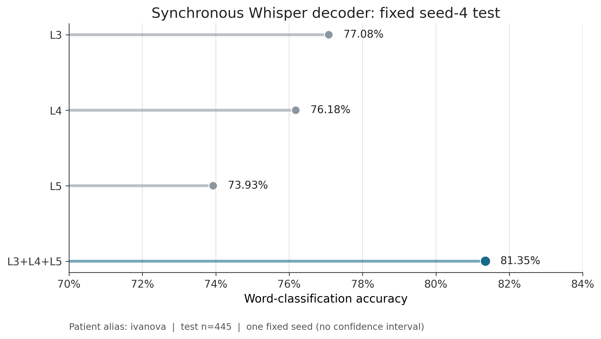

# 02 · Whisper: синхронное декодирование

[← MEL baseline](../01_mel_baseline/README.md) · [На главную](../README.md) ·
[Ансамбль L3+L4+L5 →](../03_whisper_ensemble/README.md)

Этот этап заменяет MEL-цель внутренним представлением Whisper, сохраняя
синхронную постановку: для каждого примера заранее известно, где находится слово
и какое нейронное окно ему соответствует.

## Текущая архитектура

```text
аудио → Whisper encoder L3/L4/L5: 512D @ 50 Hz
      → train-only scaler/PCA → target 50D
                                  ↑ regression loss
ECoG-окно, LAG_BACKWARD=1000 downsampled samples
                       → ECoG-энкодер: 1001 отсчёт
                       → hidden 3030D → linear 50D
        ↓ берём hidden 3030D до linear
классификатор слова (27 классов: silence + 26 слов)
        ↓
softmax и accuracy на фиксированном тесте
```

L3, L4 и L5 — три **отдельно обученных** пути с одинаковой постановкой, но
разными target-представлениями Whisper. В имени модели сохранена историческая
опечатка `CNANNELS`; исправлять её нельзя без миграции имён чекпойнтов.

Здесь два числа отвечают за разные вещи: `50` — размер PCA-сжатой акустической
цели Whisper, а `3030` — внутренний вектор ECoG-регрессора перед последним
линейным слоем. Ни одно из них не является числом слов; классов в словаре 27.

Число `1000` в `LAG_1000_0` — количество интервалов назад на сетке **после
downsampling**, а не точные миллисекунды. В окно включены обе границы, поэтому
оно содержит 1001 отсчёт. Для `ivanova` исходная частота 4096 Гц понижается
decimation-фактором 4 до 1024 Гц: расстояние между концами окна равно
`1000 / 1024 = 976,6 мс`.
Для конфигурации `procenko` это около 989,6 мс. Поэтому корректное общее
обозначение — «номинально около одной секунды».

## Актуальные файлы

| Файл | Назначение |
|---|---|
| `train_sync.py` | запуск одного регрессионного или классификационного этапа |
| `multiseed.py` | оркестрация нескольких сидов |
| `library/` | модели, препроцессинг, runners и построение Whisper targets |
| `run_single_layer.ps1` | рекомендуемая PowerShell-обёртка |

Рабочий `library/patients.json` намеренно не публикуется. Создайте локальный файл
по `library/patients.example.json`, не добавляйте реальные пути и идентификаторы
в git. В своей копии замените буквальный префикс-заполнитель `DATA_ROOT` во всех
элементах `files_list` на разрешённый локальный каталог с данными; сам example
оставьте без изменений.

## Запуск

Из папки `02_whisper_sync` после подготовки локального `patients.json`:

```powershell
.\run_single_layer.ps1 -Patient ivanova -Layer 3 -Seed 4
.\run_single_layer.ps1 -Patient ivanova -Layer 4 -Seed 4
.\run_single_layer.ps1 -Patient ivanova -Layer 5 -Seed 4
```

Каждая команда последовательно обучает ECoG→Whisper-PCA регрессию и word-head.
Если encoder уже подготовлен и однозначно лежит в `model_dumps`, используйте
`-SkipRegression`; для одной только первой стадии — `-RegressionOnly`.

## Зафиксированный результат

Пациент `ivanova`, `seed=4`, фиксированная тестовая поверхность `n=445`:

| Target | Accuracy |
|---|---:|
| Whisper L3 | **0,7708** |
| Whisper L4 | 0,7618 |
| Whisper L5 | 0,7393 |

Результаты одиночных слоёв переходят в следующий этап без переобучения:
[ансамбль усредняет их вероятности](../03_whisper_ensemble/README.md).



## Что означает «замороженный upstream» дальше

Для continuous-head используются сохранённые регрессионные Whisper-энкодеры
этого этапа. Их параметры не обновляются: из непрерывных окон один раз строятся
3030D-признаки. Синхронный `Mel2WordHidden` целиком загружается из checkpoint и
дообучается на continuous-окнах как 27-классовая endpoint-задача (`silence + 26
слов`); это не бинарная голова присутствия события. Случайно новой головы здесь
нет. Это
сокращает время и изолирует вопрос: «достаточно ли уже выученного Whisper-
представления для continuous-задачи?» Полное end-to-end дообучение является
отдельным экспериментом и не подменяет этот результат.

## Условия корректного повтора

- тот же пациент, split, каналы, препроцессинг и
  `LAG_BACKWARD=1000` downsampled samples с 1001-отсчётным inclusive-окном;
- заранее заданный seed и одинаковая тестовая поверхность;
- selection чекпойнта только по train/validation;
- тест открывается после фиксации модели;
- версии зависимостей и контрольные суммы весов записаны в отчёт.

Без закрытых данных и разрешённых весов код не является полностью автономным
воспроизводимым пакетом.
