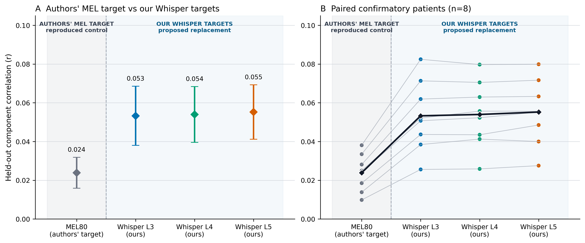

# Внешняя валидация: SWPD и VocalMind

Отдельный трек внешней валидации, не изменяющий исторические пайплайны
Ivanova/Procenko и не использующий их patient-specific веса.

[SWPD matched PCA50 — результаты, графики и аудит](swpd_matched_pca50/README.md) ·
[Обучаемое сжатие SWPD — PCA, sRRR, CLIP и alternating](swpd_learned_bottleneck/README.md) ·
[SWPD setup](SWPD_README.md) ·
[VocalMind runbook](VOCALMIND_PRIMARY_RUNBOOK.md) ·
[Общий протокол](PROTOCOL_DRAFT.md) ·
[Лабораторный журнал](LAB_JOURNAL.md)

## Текущий статус

| Dataset | Постановка | Статус |
|---|---|---|
| SWPD | Matched MEL80 vs Whisper L3/L4/L5, train-only PCA50 + OLS | **Завершено: primary n=8** |
| SWPD `sub-01` follow-up | PCA50 против sRRR50, CLIP50 и alternating50 на общей MEL80-поверхности | **Завершено: PCA50 сохранён, learned bottlenecks не дали прибавки** |
| VocalMind | Повторяемое Mandarin word decoding на второй системе | Выполняется отдельно; результаты этого компьютера не подменяют внешний run |

## SWPD: зафиксированный результат



| Система | Correlation, mean ± SD | 95% t-CI |
|---|---:|---:|
| MEL80 | 0,02388 ± 0,00956 | [0,01588; 0,03187] |
| Whisper L3 | 0,05327 ± 0,01828 | [0,03799; 0,06856] |
| Whisper L4 | 0,05397 ± 0,01726 | [0,03954; 0,06840] |
| Whisper L5 | **0,05522 ± 0,01685** | **[0,04113; 0,06930]** |

L3/L4/L5 превысили MEL80 у всех `8/8` confirmatory пациентов. Все три
предзаданных сравнения остаются значимыми после Holm correction.

Полный разбор: [swpd_matched_pca50](swpd_matched_pca50/README.md).

## Scientific guardrails

- SWPD имеет 100 уникальных слов на участника и не используется как обычная
  within-subject 100-class классификация.
- Visual cue timestamps задают только границы temporal blocks и не называются
  акустическими началами слов.
- Primary SWPD metric — all-frame representation predictability, не word accuracy.
- High-gamma и Whisper targets офлайн/некаузальны; SWPD-результат не является
  real-time или asynchronous decoder.
- L3/L4/L5 имеют отдельные train-only PCA bases, поэтому прямое усреднение их
  PCA-координат не объявляется ансамблем.
- Patient, а не frame, fold или optimizer seed, является статистической единицей.
- `sub-01` исключён из primary inference как development subject.
- `sub-10` исключён по source-only QC: официальная запись заканчивается после
  95 валидных trials. Решение, контрольные суммы и отсутствие модели для него
  сохранены отдельно.

## Что публикуется

- read-only adapters и код extraction/training/evaluation;
- frozen configs и QC amendment;
- агрегированные JSON/CSV и PNG/SVG;
- машинно-проверяемые receipts и аудит;
- Windows 11 bootstrap/run scripts.

Не публикуются исходные записи, производные массивы, caches, checkpoints, логи,
локальные пути к данным и чувствительные метаданные.

## Windows 11 setup

После клонирования откройте PowerShell в этой папке.

```powershell
Set-ExecutionPolicy -Scope Process Bypass
.\scripts\bootstrap_windows.ps1 -Dataset swpd -DataRoot "C:\WhisperECoG\data"
```

Для VocalMind на отдельной системе:

```powershell
Set-ExecutionPolicy -Scope Process Bypass
.\scripts\bootstrap_windows.ps1 -Dataset vocalmind -DataRoot "D:\WhisperECoG\data" -InstallSystemTools
```

Точный порядок подготовки данных и запуска описан в [RUNBOOK_RU.md](RUNBOOK_RU.md).
Разработческие решения и обнаруженные дефекты записаны в
[LAB_JOURNAL.md](LAB_JOURNAL.md).
