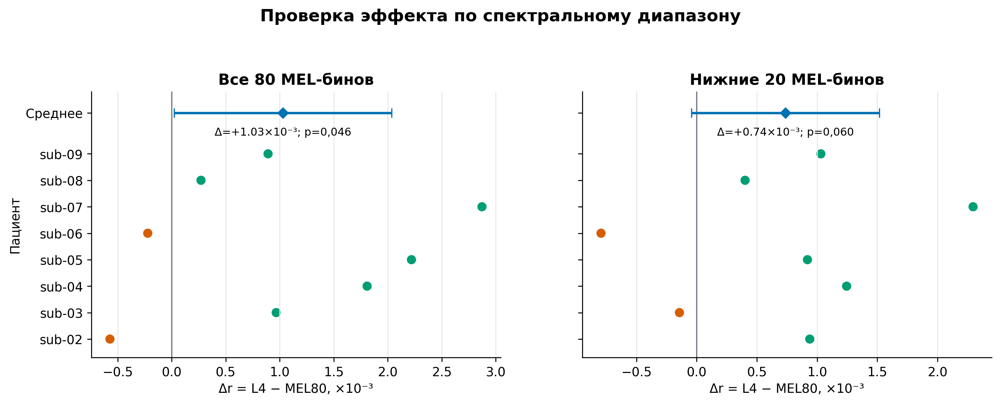

# SWPD: финальный frozen contextual-анализ

Это основной публикационный результат внешней валидации на публичном ECoG-датасете
Single Word Production Dataset (SWPD). Анализ был зафиксирован после разработки
только на `sub-01`, а затем без смены системы выполнен на `sub-02…sub-09`.


## Главный результат

Статистическая единица — пациент (`n=8`), а не кадр или временной фолд.

| Система | Средний Pearson `r` | SD | 95% t-CI |
|---|---:|---:|---:|
| Прямой MEL80-контроль | 0,69187 | 0,10918 | [0,60060; 0,78314] |
| Whisper L4 → PCA50 → MEL80 | **0,69290** | 0,10884 | [0,60190; 0,78390] |
| Парная разница L4 − MEL | **+0,00103** | 0,00120 | **[+0,00002; +0,00204]** |

Whisper L4 выиграл у MEL80 у `6/8` пациентов. Предзаданный двусторонний парный
t-тест дал `p=0,0462`; точный знаковый тест — `p=0,2891`. Следовательно,
направление эффекта положительное и t-интервал едва исключает ноль, но практически
эффект очень мал и не подтверждается непараметрическим тестом. Корректный вывод:
**L4 сопоставим с прямым MEL80 и даёт малый, погранично значимый прирост**, а не
«существенно превосходит MEL».

По нижним 20 MEL-бинам прирост составил `+0,00074`, 95% t-CI
`[-0,00004; +0,00152]`, paired `t p=0,0604`, sign `p=0,2891`.



## Результаты по пациентам

| Пациент | MEL80 | Whisper L4 | Δ L4−MEL | MEL80 low20 | L4 low20 |
|---|---:|---:|---:|---:|---:|
| sub-02 | 0,61081 | 0,61023 | −0,00057 | 0,64548 | 0,64642 |
| sub-03 | 0,81326 | 0,81423 | +0,00097 | 0,85542 | 0,85528 |
| sub-04 | 0,75967 | 0,76148 | +0,00181 | 0,77501 | 0,77626 |
| sub-05 | 0,52152 | 0,52374 | +0,00222 | 0,54061 | 0,54153 |
| sub-06 | 0,84379 | 0,84357 | −0,00022 | 0,87474 | 0,87395 |
| sub-07 | 0,66670 | 0,66957 | +0,00287 | 0,68934 | 0,69164 |
| sub-08 | 0,69646 | 0,69673 | +0,00027 | 0,69583 | 0,69624 |
| sub-09 | 0,62275 | 0,62364 | +0,00089 | 0,66795 | 0,66898 |

Машиночитаемые значения находятся в
[`results/population_summary.json`](results/population_summary.json) и
[`results/frozen_subject_metrics.csv`](results/frozen_subject_metrics.csv).

## Что было зафиксировано до confirmatory-прогона

На development-пациенте `sub-01` прямой MEL80 дал `r=0,48611`, а выбранный
Whisper L4/PCA50 — `r=0,49362` (`Δ=+0,00752`). После переноса на восемь пациентов
эффект уменьшился приблизительно в семь раз. Это ожидаемая проверка обобщаемости,
а не основание заменить frozen-результат development-числом.

До фиксации L4 были проверены альтернативы:

- supervised RRR50: `r=0,4890`, хуже PCA50 на `−0,0047`;
- CLIP50: `r=0,4494`, хуже PCA50 на `−0,0442`;
- alternating50: валидация во всех пяти фолдах оставила исходную итерацию 0,
  то есть результат совпал с PCA50.

Эти отрицательные эксперименты отражены здесь как журнал принятия решения, но их
временные launch-скрипты и дубли кода не входят в финальный публичный модуль.

## Сопоставляемая архитектура

Обе системы используют одни и те же:

- пять последовательных визуальных блоков: три train, следующий validation,
  один held-out test;
- high-gamma ECoG-контекст `−200…+200 мс`, выходную сетку 20 мс и 1-секундный
  защитный край каждого блока;
- fold-train `StandardScaler → PCA50` для нейронных признаков;
- обычную линейную регрессию OLS;
- итоговую поверхность из 80 стандартизованных MEL-бинов.

Различается только промежуточная цель:

```text
Прямой контроль: ECoG → neural PCA50 → OLS → MEL80
Whisper-система: ECoG → neural PCA50 → OLS → L4 PCA50 → train-only probe → MEL80
```

Whisper-base закреплён на ревизии
`e37978b90ca9030d5170a5c07aadb050351a65bb`. PCA и стандартизаторы обучаются
только на train-блоках соответствующего фолда. Validation-блок не входит в fit,
test открывается только для итоговой оценки.

## Когорта и ограничения

- `sub-01` — только разработка и выбор L4; он исключён из primary inference.
- `sub-02…sub-09` — frozen contextual cohort, `n=8`.
- `sub-10` исключён заранее по зафиксированной QC-поправке: официальная запись
  заканчивается после 95 валидных trials.
- Ранее этот датасет уже использовался в отдельном non-contextual анализе.
  Поэтому это **frozen contextual extension**, а не утверждение о полностью
  никогда не открывавшейся когорте.
- Препроцессинг и Whisper офлайн/некаузальны; этот результат не является
  online- или asynchronous-декодером.
- Числа этого раздела нельзя смешивать с прежней корреляцией 50 PCA-координат:
  здесь обе системы оценены после обратной проекции на общую MEL80-поверхность.

## Воспроизведение

Из папки `05_external_validation/swpd_contextual_frozen`:

```powershell
Set-ExecutionPolicy -Scope Process Bypass
.\scripts\start_frozen_background.ps1
.\scripts\watch_frozen.ps1 -Follow
```

`Ctrl+C` в watcher останавливает только просмотр. Завершённые block-кэши и
пациентные receipts проверяются по SHA-256 и повторно не вычисляются.

Для пересборки публикационных графиков из сохранённого агрегата:

```powershell
..\.venv\Scripts\python.exe .\scripts\build_figures.py
```

Исходные NWB, кэши, покадровые предсказания и локальные пути в Git не входят.
Если полный локальный development-summary отсутствует, runner проверяет его
зафиксированную SHA-256 и выбранные значения по компактному
[`results/development_gate.json`](results/development_gate.json); этот gate не
подменяет исходный подробный артефакт.
Контрольные суммы опубликованных таблиц и изображений записываются в
[`figures/figure_manifest.json`](figures/figure_manifest.json).
