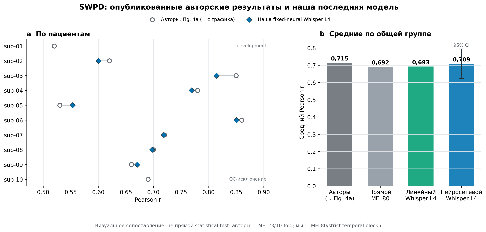

# Frozen fixed-Q neural на SWPD sub-02…sub-09

Это population follow-up после разработки на `sub-01`. Зафиксирован победивший
вариант: neural-декодер с неизменным Whisper L4/PCA50 target-space. Alternating
исключён до population-прогона, потому что на `sub-01` он был хуже fixed-Q.

- пациенты: `sub-02…sub-09`, `n=8`; `sub-10` сохраняет прежнее QC-исключение;
- пять временных folds и seeds `1,2,3,4,42`;
- 5 циклов × 10 эпох, архитектура и optimizer без нового подбора;
- число входных каналов определяется отдельно для пациента, hidden-размеры
  остаются фиксированными;
- fit/validation не открывает fold-role test; test запускается отдельной командой.

Запуск fit-only в фоне:

```powershell
Set-ExecutionPolicy -Scope Process Bypass
.\scripts\start_fit_background.ps1
.\scripts\watch_fit.ps1 -Follow
```

Только после `FIT COMPLETE`:

```powershell
.\scripts\run_evaluate.ps1
```

Primary статистическая единица — пациент: сначала усредняются folds внутри seed,
затем seeds внутри пациента, и только затем считается парная разница по восьми
пациентам. Это frozen secondary analysis, поскольку SWPD-когорта ранее уже
использовалась в линейном contextual-анализе.

## Финальный результат



| Система | Средний Pearson `r` | 95% t-CI |
|---|---:|---:|
| Прямой MEL80, наш matched-контроль | 0,69187 | [0,60060; 0,78314] |
| Линейный Whisper L4 | 0,69290 | [0,60190; 0,78390] |
| **Fixed-neural Whisper L4** | **0,70935** | **[0,62425; 0,79444]** |

Fixed-neural превысил линейный L4 у `7/8` пациентов. Средняя парная разница
`+0,01645`, 95% CI `[−0,00240; +0,03529]`; paired t-test `p=0,0779`, exact sign
test `p=0,0703`. Это положительная тенденция, но не подтверждённое на уровне
`p<0,05` превосходство.

Для ориентира на рисунке приведены приблизительно оцифрованные высоты столбцов
[Figure 4a из Verwoert et al. (2022)](https://pmc.ncbi.nlm.nih.gov/articles/PMC9307753/).
Для общей группы `sub-02…sub-09` их среднее
составляет примерно `0,715`, наше — `0,709`. Это **не прямой статистический тест**:
авторы использовали MEL23 и последовательную 10-fold CV, а наш протокол — MEL80,
строгие временные блоки и отдельную validation-роль.

Числа и происхождение фигуры:

- [`results/final_summary.json`](results/final_summary.json) — точные frozen-метрики;
- [`results/authors_figure4a_digitized.csv`](results/authors_figure4a_digitized.csv) —
  приблизительная оцифровка опубликованного графика;
- [`scripts/build_figures.py`](scripts/build_figures.py) — воспроизводимая сборка PNG/SVG.
