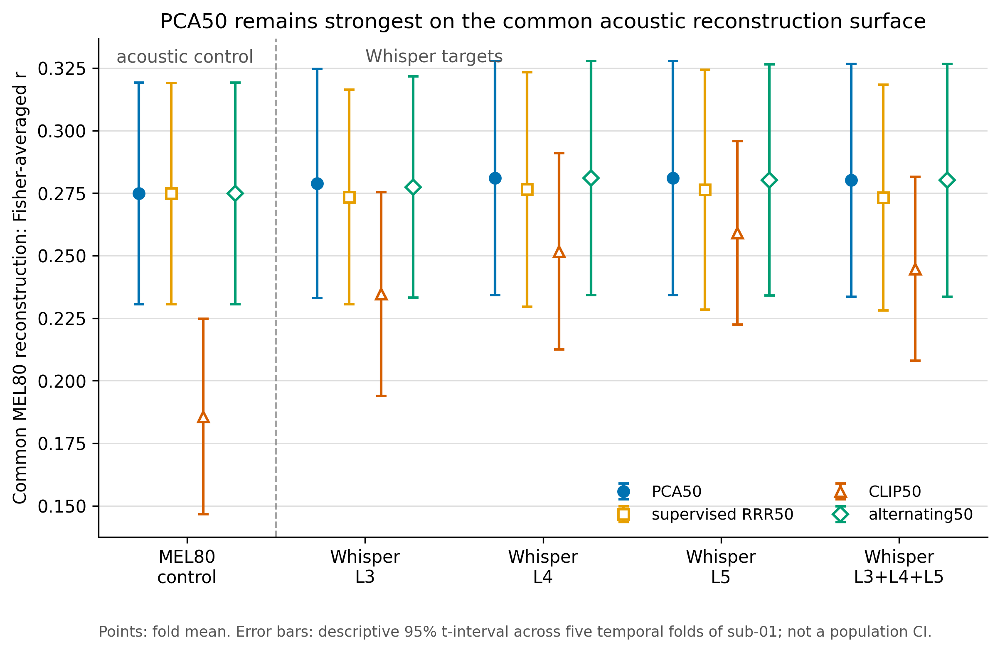
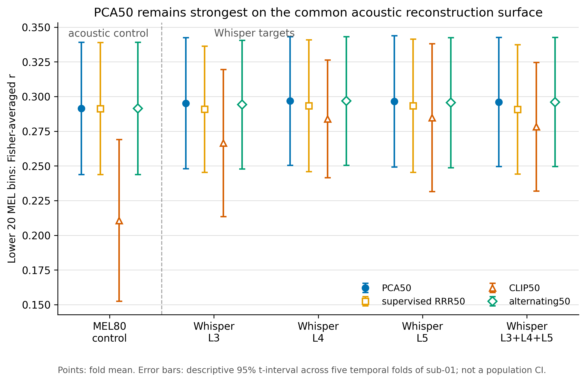
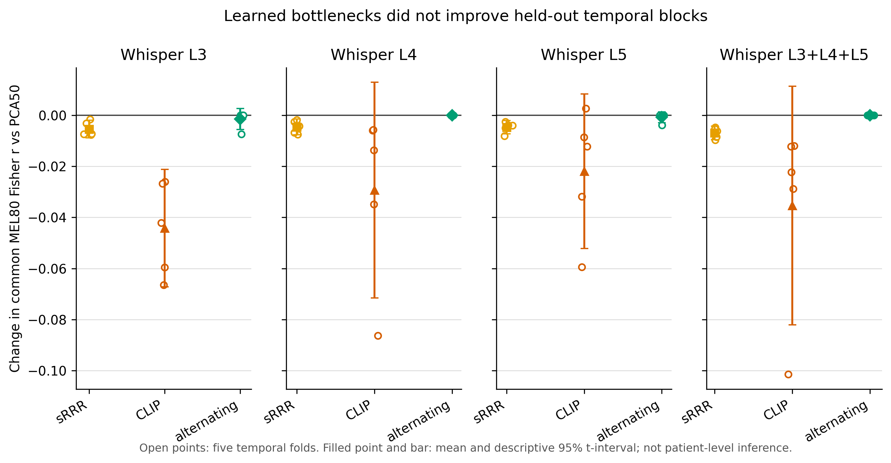

# SWPD learned bottleneck (development subject `sub-01`)

This isolated follow-up tests whether a train-only learned 50-dimensional target
subspace is more neurally predictable than the existing unsupervised PCA50
subspace. It does not modify the frozen matched-PCA50 implementation or results.

[Frozen result record](RESULTS_2026-07-29.md) | [machine-readable table](figures/table_01_bottleneck_performance.csv) | [figure manifest](figures/figure_manifest.json)

## Result

PCA50 remains the selected development method. Neither supervised RRR50, CLIP50,
nor constrained alternating optimization improved the common held-out MEL80
reconstruction surface.

| Method / best Whisper target | Common MEL80 r, mean ± SD | Lower 20 MEL bins, mean ± SD |
|---|---:|---:|
| **PCA50 / L5** | **0.2810 ± 0.0376** | 0.2965 ± 0.0381 |
| supervised RRR50 / L4 | 0.2765 ± 0.0378 | 0.2934 ± 0.0383 |
| CLIP50 / L5 | 0.2591 ± 0.0295 | 0.2848 ± 0.0429 |
| alternating50 / L4 | 0.2810 ± 0.0376 | **0.2968 ± 0.0374** |

The alternating L4 value equals PCA50 because validation selected the unchanged
PCA initialization in every L4 fold. Across all target/fold tasks, alternating
optimization selected iteration zero in 23/25 cases. The other two validation
selections reduced held-out test performance.







Error bars are descriptive 95% t-intervals across five temporal folds of the
single development participant `sub-01`. They are not population confidence
intervals and the folds are not independent patients.

## Protocol

Phase 1 compares:

- `pca50`: deterministic train-only PCA50 control;
- `srrr50`: deterministic supervised reduced-rank projector with orthonormal
  columns, fitted from the train neural subspace only;
- targets `MEL80`, `L3`, `L4`, `L5`, and concatenated `L3+L4+L5` (1536 -> 50).

Every fold uses three train blocks, the next block for validation, and one held-out
test block. All scalers, projectors, decoders, and the common MEL80 diagnostic
probe are fitted only on train frames. The common MEL probe and its lower 20 bins
are the cross-representation comparison; the 50-coordinate correlation remains
representation-specific.

The runner refuses any cache directory not named `sub-01`. Confirmatory subjects
are not read during development.

Start the full five-fold phase in a hidden PowerShell process:

```powershell
Set-Location "<repo>\05_external_validation\swpd_learned_bottleneck"
Set-ExecutionPolicy -Scope Process Bypass
.\scripts\start_sub01_phase1_background.ps1
```

Inspect progress (Ctrl+C stops only the watcher):

```powershell
.\scripts\watch_sub01_phase1.ps1 -Follow
```

After phase 1 is frozen, start the separate CLIP50 development run:

```powershell
.\scripts\start_sub01_clip_background.ps1
.\scripts\watch_sub01_clip.ps1 -Follow
```

CLIP uses symmetric InfoNCE, an orthonormal target projector, train-only PCA
initialization, validation-only early stopping, and negatives separated by at
least 500 ms within the same recording block. Test data are evaluated only after
the validation checkpoint is fixed.

Run the third, constrained alternating development method after CLIP is frozen:

```powershell
.\scripts\start_sub01_alternating_background.ps1
.\scripts\watch_sub01_alternating.ps1 -Follow
```
