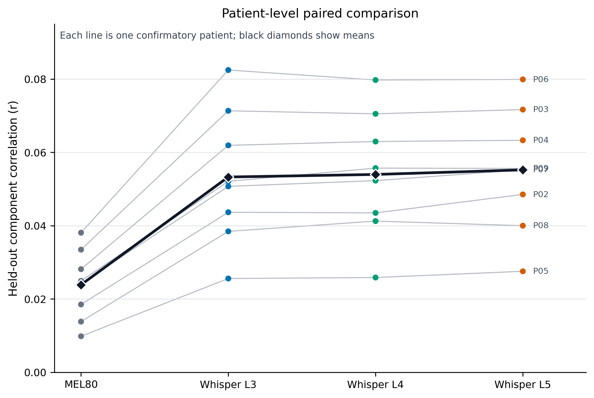
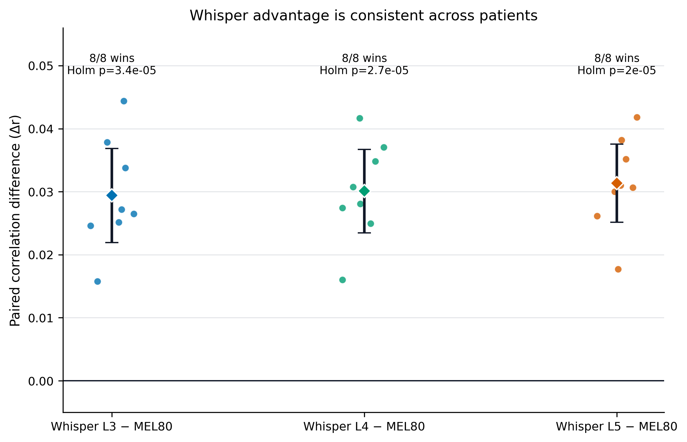
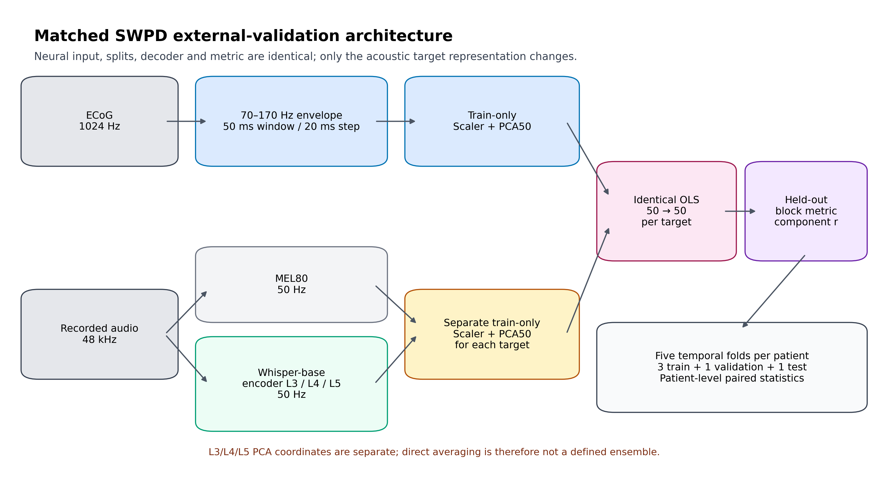
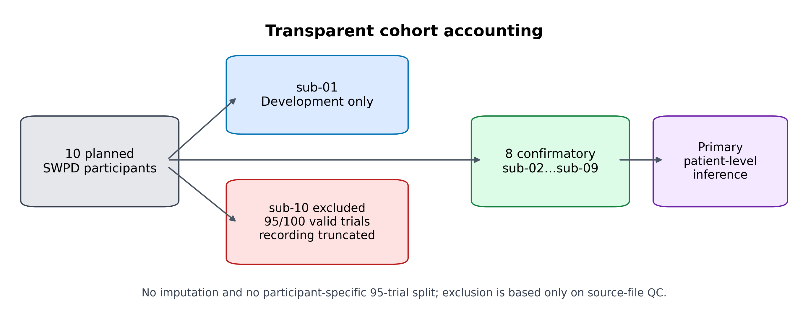

# SWPD: matched MEL80 vs Whisper L3/L4/L5

Независимая внешняя валидация на публичном инвазивном датасете
SingleWordProductionDutch (SWPD). Здесь MEL80 и слои Whisper сравниваются на
одинаковых ECoG-кадрах, temporal splits, train-only PCA50, OLS-декодере и
patient-level статистике.

[Результаты](#главный-результат) ·
[Архитектура](#архитектура) ·
[QC выборки](#выборка-и-qc) ·
[Аудит](#аудит-воспроизводимости) ·
[Код](#код-и-воспроизведение) ·
[Ограничения](#границы-интерпретации)

## Главный результат

Primary confirmatory cohort: `sub-02…sub-09`, **n=8 пациентов**. `sub-01`
использовался только для разработки, а `sub-10` исключён по объективному QC
исходной записи.

### Метрики систем

| Система | Correlation, mean ± SD | 95% t-CI | Standardized MSE, mean ± SD |
|---|---:|---:|---:|
| MEL80 | 0,02388 ± 0,00956 | [0,01588; 0,03187] | 1,04511 ± 0,01397 |
| Whisper L3 | 0,05327 ± 0,01828 | [0,03799; 0,06856] | 0,89148 ± 0,01155 |
| Whisper L4 | 0,05397 ± 0,01726 | [0,03954; 0,06840] | 0,92196 ± 0,01227 |
| Whisper L5 | **0,05522 ± 0,01685** | **[0,04113; 0,06930]** | **0,87929 ± 0,01589** |

`Correlation` — Fisher-pooled корреляция 50 предсказываемых PCA-компонент на
held-out блоках, сначала агрегированная внутри пациента, затем по пациентам.
Это не accuracy распознавания слов.

### Предзаданные парные сравнения

| Сравнение | Δr, mean ± SD | 95% t-CI | Победы | Raw p | Holm p |
|---|---:|---:|---:|---:|---:|
| L3 − MEL80 | +0,02940 ± 0,00891 | [0,02195; 0,03685] | 8/8 | 3,37×10⁻⁵ | 3,37×10⁻⁵ |
| L4 − MEL80 | +0,03009 ± 0,00793 | [0,02347; 0,03672] | 8/8 | 1,34×10⁻⁵ | 2,67×10⁻⁵ |
| L5 − MEL80 | **+0,03134 ± 0,00743** | **[0,02513; 0,03755]** | **8/8** | 6,59×10⁻⁶ | **1,98×10⁻⁵** |

Как дополнительная, не preregistered sensitivity-проверка, направление эффекта
`8/8` даёт exact two-sided sign-test `p=0,0078125` для каждого слоя.

## Архитектура

| Компонент | Зафиксированная реализация |
|---|---|
| ECoG | официальный SWPD NWB, номинально 1024 Гц |
| Neural features | 70–170 Гц Hilbert envelope; notch 98–102 и 148–152 Гц |
| Временная сетка | окно 50 мс, шаг 20 мс |
| Acoustic targets | MEL80 и Whisper-base encoder L3/L4/L5 |
| Размер targets | raw 80D/512D → отдельный train-only standardized PCA50 |
| Neural reducer | один общий для всех targets train-only standardized PCA50 в каждом fold |
| Splits | пять последовательных 20-trial блоков; 3 train + 1 validation + 1 test |
| Decoder | одинаковый `sklearn.linear_model.LinearRegression` 50→50 |
| Primary metric | subject mean of fold-level Fisher-pooled component correlation |
| Population statistics | patient-level paired t-test; Holm по трём Whisper−MEL сравнениям |

PCA-базисы L3, L4 и L5 обучаются отдельно. Поэтому их координаты нельзя просто
усреднить, и этот эксперимент **не является L3+L4+L5-ансамблем**.

## Выборка и QC

В официальном `sub-10` присутствуют 100 строк word events, но только 95 имеют
положительную длительность. Последние пять указывают на последний отсчёт
`291899` записи длиной 291900 отсчётов. Нейронного и аудиосегмента для них нет.

Поэтому `sub-10` исключён целиком:

- без импутации;
- без специального split на 95 trials;
- до получения какой-либо модели или test-результата для `sub-10`;
- с отдельным датированным QC amendment и контрольными суммами.

## Аудит воспроизводимости

Итог аудита: **PASS WITH DOCUMENTED LIMITATIONS**.

Проверено независимо:

- 9 анализируемых участников и 45 temporal folds;
- 225 train-only PCA-редукторов;
- 180 OLS-моделей повторно обучены и совпали с сохранёнными коэффициентами;
- 522 620 строк predictions пересчитаны;
- train/validation/test IDs не пересекаются;
- все четыре targets используют одинаковые held-out IDs;
- fold metrics, patient aggregation, t-CI, paired tests и Holm correction совпали;
- исходный дефект `sub-10` повторно подтверждён, модели для него нет.

Полный документ: [CODE_AUDIT.md](CODE_AUDIT.md).
Машиночитаемый receipt: [audit_receipt.json](audit_receipt.json).

## Код и воспроизведение

Основные исполняемые файлы находятся уровнем выше, чтобы SWPD и VocalMind
использовали одну библиотеку внешней валидации:

- [swpd_matched_all.py](../swpd_matched_all.py) — замороженная очередь пациентов;
- [swpd_finalize_qc.py](../swpd_finalize_qc.py) — проверяемая QC-финализация;
- [matched_linear.py](../src/whisper_ecog_ext/swpd/matched_linear.py) — extraction, folds и OLS;
- [nwb.py](../src/whisper_ecog_ext/swpd/nwb.py) — read-only NWB adapter;
- [reducer.py](../src/whisper_ecog_ext/reducer.py) — train-only PCA artifacts;
- [targets.py](../src/whisper_ecog_ext/targets.py) — MEL80 и Whisper L3/L4/L5;
- [audit_swpd_confirmatory_run.py](../scripts/audit_swpd_confirmatory_run.py);
- [build_swpd_publication_assets.py](../scripts/build_swpd_publication_assets.py).

Зафиксированные протоколы:

- [основной confirmatory protocol](../configs/experiments/swpd_all_matched_pca50_v1.json);
- [QC amendment для sub-10](../configs/experiments/swpd_all_matched_pca50_v1_qc_amendment_sub10.json);
- [компактная запись результата](../results_records/swpd_matched_pca50_confirmatory_qc_v2_20260728.json).

Исходные NWB, block caches, checkpoints и локальные пути запуска в GitHub не
включаются. Полные команды установки и подготовки данных находятся в
[SWPD_README.md](../SWPD_README.md) и [RUNBOOK_RU.md](../RUNBOOK_RU.md).

## Файлы для статьи

- [системные метрики CSV](table_01_system_performance.csv);
- [контрасты CSV](table_02_whisper_vs_mel_contrasts.csv);
- [метрики пациентов CSV](table_03_patient_level_metrics.csv);
- [готовые Markdown-таблицы](publication_tables.md);
- [подписи к рисункам](figure_captions.md);
- PNG 300 dpi и SVG для каждого рисунка.

## Границы интерпретации

Поддерживается вывод о преимуществе Whisper-представлений над MEL80 в задаче
offline matched representation decoding на SWPD.

Этот эксперимент не доказывает:

- accuracy распознавания отдельных слов;
- speech-only качество;
- causal/real-time работу;
- асинхронное обнаружение событий;
- преимущество ансамбля L3+L4+L5.
