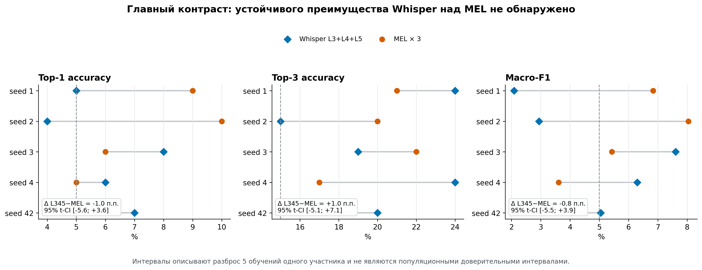

# VocalMind: финальный OOF-результат

Здесь зафиксирован законченный внешний прогон 20-классового декодирования
произнесённых слов на публичном датасете
[VocalMind](https://www.nature.com/articles/s41597-025-04741-2). Это один
участник, пять независимых инициализаций обучения и строгая out-of-fold-оценка
по repetitions 1–5.

**Главный вывод:** ансамбль Whisper `L3+L4+L5` не показал устойчивого
преимущества над вычислительно согласованным `MEL×3`. По Top-1 он ниже MEL на
1,0 процентного пункта, по Top-3 выше на 1,0 п.п.; оба описательных интервала
разности включают ноль.


## Итоговые метрики

Среднее и SD рассчитаны по training seeds `1, 2, 3, 4, 42`. Каждое обучение
оценивается на одних и тех же 100 уникальных held-out trials: 20 слов × 5
повторений. Случайный ориентир равен `5%` для Top-1 и `15%` для Top-3.

| Система | Top-1, % | Top-3, % | Macro-F1, % |
|---|---:|---:|---:|
| Whisper L3 | 5,8 ± 2,9 | 15,6 ± 5,9 | 5,39 ± 4,05 |
| Whisper L4 | 6,8 ± 1,6 | 17,2 ± 2,2 | 4,91 ± 0,66 |
| Whisper L5 | 5,2 ± 0,8 | **21,6 ± 6,4** | 4,02 ± 0,83 |
| **Whisper L3+L4+L5** | 6,0 ± 1,6 | 20,4 ± 3,8 | 4,80 ± 2,29 |
| **MEL×3** | **7,0 ± 2,3** | 19,4 ± 2,3 | **5,60 ± 1,86** |

Здесь `L3+L4+L5` — заранее заданное арифметическое среднее трёх softmax-матриц,
а `MEL×3` — такое же среднее трёх MEL-инициализаций. Подбор подмножества моделей
по тесту не выполнялся.

## Главный парный контраст

| Метрика | L3+L4+L5 | MEL×3 | Δ Whisper−MEL | Описательный 95% t-CI Δ |
|---|---:|---:|---:|---:|
| Top-1 | 6,0% | 7,0% | **−1,0 п.п.** | [−5,65; +3,65] п.п. |
| Top-3 | 20,4% | 19,4% | **+1,0 п.п.** | [−5,08; +7,08] п.п. |
| Macro-F1 | 4,80% | 5,60% | **−0,81 п.п.** | [−5,55; +3,93] п.п. |



Top-1-разности по seeds равны `−4, −6, +2, +1, +2` п.п. Поэтому средняя
разница мала и её знак зависит от инициализации. Это корректнее описывать как
**нейтральный/отрицательный внешний результат**, а не как доказанное ухудшение
Whisper.

## Что именно было обучено

В каждом из пяти folds одна repetition является test, следующая циклически —
validation, остальные три — train. На fold приходится 60 train, 20 validation
и 20 test trials.

Общий путь одинаков для всех акустических целей:

```text
110 каналов sEEG
→ фиксированный neural preprocessing
→ окна [t−1000 мс, t]
→ OneSecondEcogEncoder
→ 3030D hidden-траектория
→ Conv + MaxPool + BiLSTM
→ softmax по 20 словам
```

Меняется только 50-мерная акустическая цель регрессионного этапа:

- MEL80 с параметрами спектра авторов → train-only PCA50;
- замороженный `openai/whisper-base`, encoder L3/L4/L5 → отдельный train-only
  PCA50 для каждого слоя.

Чекпойнты регрессии и классификатора выбирались только по validation loss.
Held-out test открывался после фиксации всех предусмотренных моделей и seeds.
Полный frozen-контракт находится в
[`VOCALMIND_PRIMARY_RUNBOOK.md`](../VOCALMIND_PRIMARY_RUNBOOK.md).

## Почему это нельзя напрямую сравнить с цифрами авторов VocalMind

В статье VocalMind опубликован baseline реконструкции акустики
`sEEG → MEL80` с метриками MCD, PCC, DTW PCC и pitch. Здесь решается другая
задача — closed-set классификация 20 слов с Top-1/Top-3 accuracy. Поэтому число
`6%` нельзя ставить рядом с авторским PCC и делать вывод «хуже авторов».

Кроме того, наш matched-протокол сохраняет историческую 1000 Гц архитектуру
проекта и независимую validation repetition. Авторская линия использует другой
нейронный preprocessing и в опубликованном коде выбирает checkpoint через
`test_loader`. Это внешний тест нашего пайплайна, а не буквальное воспроизведение
авторской модели.

## Статистические ограничения

- `biological n=1`: в VocalMind опубликован один участник;
- пять seeds измеряют стохастическую устойчивость обучения, а не биологическую
  вариативность;
- folds используют разные trials одного человека и не являются независимыми
  биологическими наблюдениями;
- приведённые 95% t-интервалы описывают пять seeds условно на этом участнике и
  **не являются population confidence intervals**;
- препроцессинг офлайн и некаузален; результат не является асинхронным или
  real-time декодированием.

## Машинно-проверяемые артефакты

- [`results/vocalmind_oof_summary.json`](results/vocalmind_oof_summary.json) —
  исходный immutable OOF-агрегат с вероятностями и provenance;
- [`results/vocalmind_oof_metrics.csv`](results/vocalmind_oof_metrics.csv) —
  исходная tidy-таблица всех seed/model/metric строк;
- [`results/model_summary.csv`](results/model_summary.csv) — компактная таблица
  средних, SD и описательных интервалов;
- [`results/primary_contrast_by_seed.csv`](results/primary_contrast_by_seed.csv) —
  парные значения основного контраста;
- [`figures/figure_manifest.json`](figures/figure_manifest.json) — SHA-256
  исходных таблиц и всех производных графиков.

Контрольные суммы исходных финальных файлов:

```text
vocalmind_oof_metrics.csv
e1caa36898f694023e1cc7ae67007a549d06ec08e6d73ad274b0b822ea2c143f

vocalmind_oof_summary.json
988988d5b926e6a3b7987a4dc7ec6dad6edd94f8f9baa66b88f0486cf81a4afa
```

Immutable OOF fingerprint:
`c638c98a405bed7df59116c0805d2534cca2bfca8cfbfe8c29eaf7825e5960c7`.

## Пересборка графиков

Из этой папки:

```powershell
py -3.10 .\scripts\build_figures.py
```

Генератор сначала проверяет SHA-256 обоих исходных OOF-файлов, сверяет
fingerprints и статистический scope, заново рассчитывает компактные таблицы и
только затем сохраняет PNG/SVG и новый checksum manifest.
