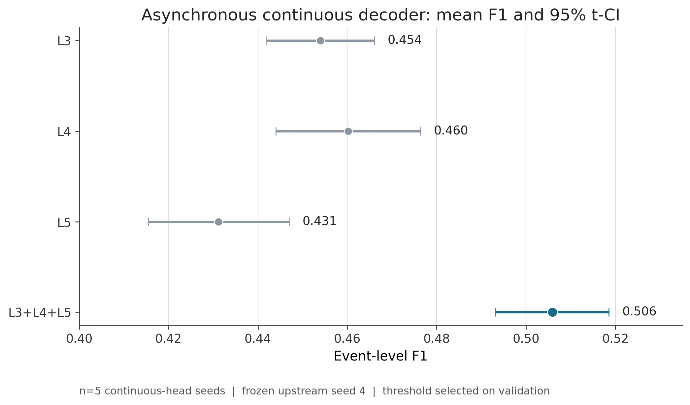
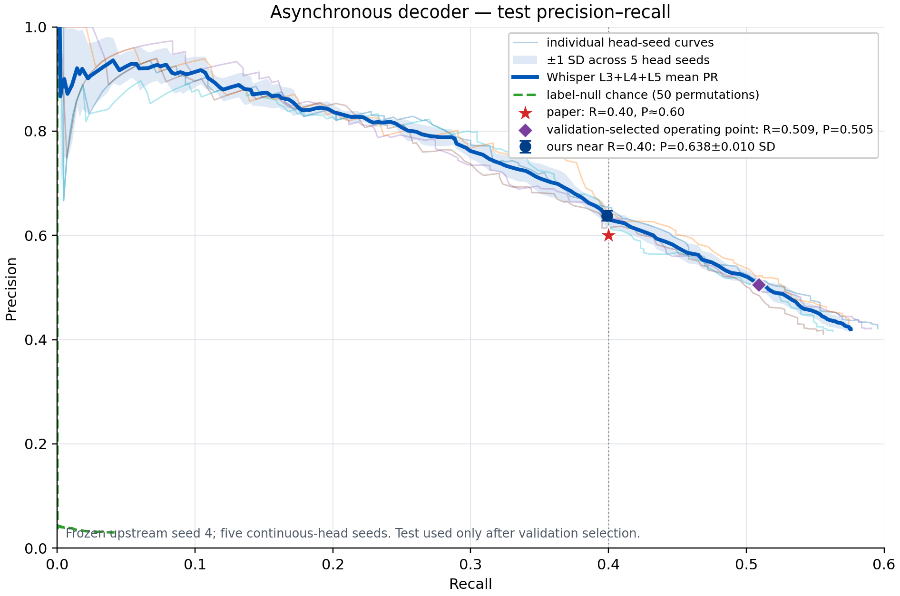
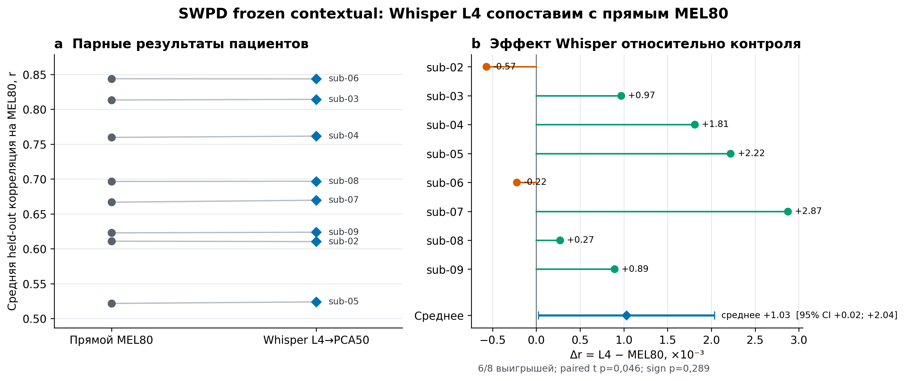
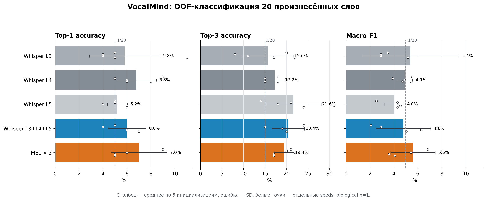

# Speech Decoding

## От MEL-бейзлайна к Whisper, ансамблю слоёв и непрерывному декодированию

Чистая исследовательская выкладка кода для четырёх исторических этапов и
отдельной внешней валидации:

**MEL baseline → Whisper synchronous → L3+L4+L5 ensemble → asynchronous / continuous decoding**

> Статус: кандидат на публичную выкладку. Код и зафиксированные агрегированные
> метрики собраны отдельно от рабочих проектов. Данные пациентов и обученные веса
> в репозиторий не входят.

[Быстрая навигация](#навигация) ·
[Главные результаты](#главные-результаты) ·
[Архитектура](docs/ARCHITECTURE.md) ·
[Внешняя валидация](05_external_validation/README.md) ·
[SWPD: финальный frozen contextual](05_external_validation/swpd_contextual_frozen/README.md) ·
[VocalMind: финальный OOF](05_external_validation/vocalmind_oof_results/README.md) ·
[Происхождение](docs/PROVENANCE.md) ·
[Чек-лист публикации](docs/PUBLISHING_CHECKLIST.md)

---

## Навигация

| Этап | Что проверяет | Код и пояснение |
|---|---|---|
| 1. MEL baseline | Воспроизведение исходной синхронной линии сравнения | [01_mel_baseline](01_mel_baseline/README.md) |
| 2. Whisper sync | Декодирование заранее выровненных слов через представления Whisper | [02_whisper_sync](02_whisper_sync/README.md) |
| 3. L3+L4+L5 | Усреднение вероятностей трёх комплементарных слоёв | [03_whisper_ensemble](03_whisper_ensemble/README.md) |
| 4. Whisper async | Скользящее декодирование без подсказки о начале слова | [04_whisper_async](04_whisper_async/README.md) |
| 5. External validation | Новый leakage-controlled MEL/Whisper L3/L4/L5 пайплайн для SWPD и VocalMind | [05_external_validation](05_external_validation/README.md) |
| 5a. SWPD frozen contextual | Финальное patient-level сравнение прямого MEL80 с заранее выбранным Whisper L4/PCA50 на общей MEL80-поверхности | [Код, результаты, графики и ограничения](05_external_validation/swpd_contextual_frozen/README.md) |
| 5b. SWPD preliminary PCA50 | Предшествующий анализ предсказуемости 50 target-компонент L3/L4/L5 | [Отдельный протокол и аудит](05_external_validation/swpd_matched_pca50/README.md) |
| 5c. SWPD neural end-to-end | Development follow-up: парный fixed-PCA50 neural-контроль против constrained alternating, 5 folds × 5 seeds | [Код и безопасный двухступенчатый запуск](05_external_validation/swpd_contextual_neural_e2e/README.md) |
| 5d. SWPD neural population | Frozen fixed-Q neural follow-up на `sub-02…sub-09`, 5 folds × 5 seeds | [Population fit и patient-level evaluation](05_external_validation/swpd_contextual_neural_population/README.md) |
| 5e. VocalMind OOF | Frozen 20-классовое сравнение Whisper L3/L4/L5/L345 с compute-matched MEL×3, 5 folds × 5 seeds | [Метрики, графики и immutable OOF-артефакты](05_external_validation/vocalmind_oof_results/README.md) |
| Результаты | Таблицы, определения метрик и графики | [results](results/README.md) |
| Веса | Ожидаемая структура и правила целостности | [checkpoints](checkpoints/README.md) |

## Главные результаты

### Синхронная задача

На фиксированной тестовой поверхности для пациента `ivanova`, `seed=4`,
`n=445`:

| Модель | Accuracy |
|---|---:|
| Whisper L3 | 0,7708 |
| Whisper L4 | 0,7618 |
| Whisper L5 | 0,7393 |
| **Ансамбль L3+L4+L5** | **0,8135** |

Ансамбль прибавил **+0,0427** к лучшему одиночному слою L3 и **+0,0517**
к L4 на той же тестовой поверхности. Это усреднение вероятностей слоёв одного
сида, а не усреднение независимых обучений.

### Асинхронная задача

> В текущем препроцессинге используются `scipy.signal.decimate` с `zero_phase`,
> несколько проходов `filtfilt`, нормировка `sklearn` по целой записи и
> центрированное сглаживание вероятностей шириной 200 мс, которому доступны
> примерно 100 мс будущего контекста.

Главный результат относится к пяти случайным инициализациям continuous-head,
но **условен на одном замороженном upstream-комплекте с `seed=4`**:

| Метрика ансамбля L3+L4+L5 | Значение |
|---|---:|
| F1 | **0,5059 ± 0,0102 SD** |
| 95% t-CI для F1 | **[0,4932; 0,5186]** |
| Precision | 0,5050 |
| Recall | 0,5088 |
| Event PR-AUC¹ | **0,4270 ± 0,0127 SD** |
| 95% t-CI для PR-AUC | [0,4112; 0,4428] |
| Ложные срабатывания | 19,65 в минуту |
| Медианная задержка | около 167 мс |

¹ Здесь event PR-AUC — трапецеидальная площадь под верхней огибающей precision
на фактически достигнутом диапазоне recall. Это не `sklearn.average_precision`
и не площадь, принудительно продолженная на весь интервал recall `[0; 1]`.

Порог главной рабочей точки выбирался только на validation. Отдельно приведён
срез тестовой PR-кривой при `Recall ≈ 0,40`: для ансамбля
`Precision = 0,6380 ± 0,0097 SD`, `F1 = 0,4910 ± 0,0044 SD`,
95% t-CI для F1 `[0,4856; 0,4964]`. Это **описательный анализ тестовой
кривой**, а не честно выбранная deployment-точка: тестовые метки участвуют в
поиске ближайшей к 0,40 точки.

Accuracy синхронной 27-классовой задачи и F1 непрерывного обнаружения событий
измеряют разные постановки и напрямую между собой не сравниваются.

### Внешняя валидация SWPD

На публичном ECoG-датасете SWPD выполнено финальное frozen contextual-сравнение.
После разработки только на `sub-01` заранее выбран Whisper L4/PCA50. Затем без
смены системы обработаны `sub-02…sub-09` (`n=8` пациентов). Прямой MEL80 и
Whisper оцениваются на одной поверхности из 80 стандартизованных MEL-бинов.

| Система | Средний Pearson `r` | 95% t-CI |
|---|---:|---:|
| Прямой MEL80-контроль | 0,69187 | [0,60060; 0,78314] |
| Whisper L4 → PCA50 → MEL80 | **0,69290** | [0,60190; 0,78390] |
| Парная разница | **+0,00103** | **[+0,00002; +0,00204]** |

L4 выиграл у `6/8` пациентов: paired `t p=0,046`, exact sign `p=0,289`.
Это малый пограничный эффект, а не практически крупное превосходство.

Полный frozen-протокол, пациентная таблица, вторичная low20-метрика, код и
контрольные суммы находятся в разделе
[SWPD contextual frozen](05_external_validation/swpd_contextual_frozen/README.md).
Предыдущий анализ корреляций 50 PCA-компонент сохранён отдельно и не смешивается
с этой общей MEL80-метрикой.

### Внешняя валидация VocalMind

На одном участнике VocalMind завершён заранее зафиксированный 20-классовый OOF-
прогон: пять repetition-folds × пять training seeds, 100 уникальных held-out
trials на seed. Главный контраст сравнивает одинаковое усреднение softmax для
Whisper `L3+L4+L5` и трёх MEL-инициализаций.

| Система | Top-1 | Top-3 | Macro-F1 |
|---|---:|---:|---:|
| Whisper L3+L4+L5 | 6,0 ± 1,6% | **20,4 ± 3,8%** | 4,80 ± 2,29% |
| MEL×3 | **7,0 ± 2,3%** | 19,4 ± 2,3% | **5,60 ± 1,86%** |
| Δ Whisper−MEL | −1,0 п.п. | +1,0 п.п. | −0,81 п.п. |

Устойчивого преимущества Whisper над MEL не обнаружено: описательные интервалы
всех трёх разностей включают ноль. Пять seeds — не пять участников;
`biological n=1`, поэтому популяционный вывод невозможен. Опубликованный
VocalMind baseline использует акустические regression-метрики, а не Top-1/Top-3,
и напрямую с этой таблицей не сравнивается.

Полный разбор, исходные immutable JSON/CSV, контрольные суммы и SVG находятся в
[разделе VocalMind OOF](05_external_validation/vocalmind_oof_results/README.md).

## Что именно находится в репозитории

- минимальный код четырёх актуальных этапов без старых логов и временных запусков;
- агрегированные результаты и готовые PNG-графики;
- описание архитектуры, происхождения артефактов и ограничений;
- шаблоны конфигурации и инструкции по подключению локальных данных/весов;
- проверки структуры релиза.

Не включены:

- исходные нейрофизиологические записи и производные массивы;
- `patients.json` с локальными путями или чувствительными метаданными;
- кэши скрытых представлений (они занимают многие гигабайты);
- обученные веса до отдельного решения по лицензии, этике и согласию;
- старые экспериментальные скрипты, логи и промежуточные чекпойнты.

## Четыре этапа эксперимента

1. **MEL baseline.** Исходный публичный проект используется как внешняя,
   закреплённая по commit зависимость. Его код не копируется без проверки лицензии.
2. **Whisper sync.** Аудио переводится в 512D-признаки выбранного слоя Whisper
   и сжимается PCA до 50D-регрессионной цели. ECoG-энкодер с окном
   `LAG_BACKWARD=1000` **отсчётов после downsampling** (номинально около 1 с)
   формирует собственный 3030D hidden-вектор перед линейным выходом; именно этот
   hidden-вектор затем используется для 27-классовой задачи слова на заранее
   выровненных сегментах. Для `ivanova` частота после decimation равна 1024 Гц:
   расстояние между концами окна составляет 976,6 мс, а само окно включает
   1001 отсчёт. Историческое имя чекпойнта остаётся `LAG_1000_0`.
3. **Whisper ensemble.** Softmax-вероятности L3, L4 и L5 усредняются для каждого
   тестового примера. Состав ансамбля фиксирован заранее.
4. **Whisper async.** Модель работает по непрерывной записи без temporal cue.
   В репозитории разделены (а) frozen replay синхронных моделей и
   (б) continuous fine-tuning синхронных word-head поверх замороженных
   upstream-представлений. Головы warm-started из seed-4 checkpoint, а не
   инициализированы заново. На каждом конце окна голова выдаёт softmax по 27
   классам (`silence + 26 слов`), а не бинарную вероятность наличия речи.
   Детекция считается истинно положительной только при правильном классе слова
   и попадании её времени в заданный допуск события.

Подробная схема, формы тензоров и границы между этапами описаны в
[архитектурном документе](docs/ARCHITECTURE.md).

## Важное ограничение сравнения со статьёй

В публичной истории исходного проекта не найден код асинхронного эксперимента
из статьи. Поэтому `frozen replay` — документированная реконструкция постановки
по описанию, а continuous-head — наше продолжение с Whisper. Репозиторий не
утверждает побитовое или архитектурно точное воспроизведение закрытой реализации
асинхронного декодера авторов.

## Перед первым запуском

1. Прочитайте [чек-лист публикации и запуска](docs/PUBLISHING_CHECKLIST.md).
2. Подготовьте локальную конфигурацию данных по примеру соответствующего этапа.
3. Разместите разрешённые к использованию веса согласно
   [checkpoints/README.md](checkpoints/README.md) и проверьте их хэши.
4. Установите зависимости из корня репозитория.
5. Запускайте этапы последовательно; точные команды находятся в README каждой
   папки.

Этот репозиторий намеренно не обещает запуск «из коробки» без закрытых данных и
весов. Его цель — сделать актуальный исследовательский код, допущения и
результаты обозримыми и проверяемыми.
