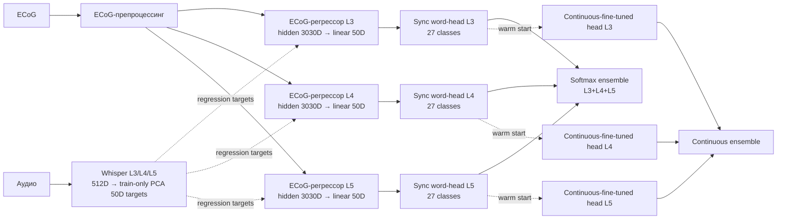
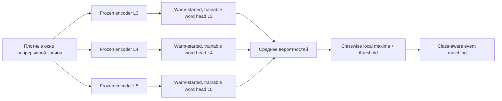

# Архитектура экспериментов

[← На главную](../README.md) · [Результаты](../results/README.md) ·
[Происхождение](PROVENANCE.md)

## Общая схема



В continuous-ветке ECoG-регрессоры заморожены, а все параметры синхронных
27-классовых word-head служат инициализацией и затем дообучаются.

## Контракты четырёх этапов

| Этап | Вход | Обучаемая цель | Выход | Основная метрика |
|---|---|---|---|---|
| MEL baseline | выровненное нейронное окно | MEL-представление | класс слова | accuracy |
| Whisper sync | выровненное нейронное окно | Whisper L3/L4/L5, PCA 50D; затем 3030D hidden | 27 классов слова/тишины | accuracy |
| Sync ensemble | вероятности трёх sync-моделей | параметров нет | класс слова | accuracy |
| Frozen replay | плотные окна непрерывной записи | параметров нет | 27-way endpoint softmax → classwise events | event P/R/F1, FP/min, latency |
| Continuous head | замороженные 3030D-признаки плотных окон | 27-классовая endpoint-метка: тишина + 26 слов | 27-way endpoint softmax → classwise events | event P/R/F1, event PR-AUC, FP/min, latency |

## 1. MEL baseline

Это внешний референсный код, а не часть новой реализации. Для чистого сравнения
фиксируются пациент, split, каналы, окно, lag, препроцессинг и определение
метрики. Меняется только акустическое target-представление.

Публичный upstream содержит синхронный pipeline. Исполняемый async-код,
соответствующий финальному эксперименту статьи, в доступной истории не найден.

## 2. Whisper sync

### Регрессионный путь

Для каждого слоя строится отдельная цель Whisper. Сырые признаки слоя имеют
512 измерений на кадр и перед регрессией проходят scaler/PCA, обученные только
на train, до 50 измерений. ECoG-модель с LSTM получает окно с исторически
зафиксированным `LAG_BACKWARD=1000` на сетке после downsampling и учится
приближать эту 50D-цель. Это номинально около одной секунды, но не ровно
1000 мс: окно включает обе границы и содержит 1001 отсчёт. Для `ivanova`
исходная частота 4096 Гц понижается decimation-фактором 4 до 1024 Гц, поэтому
между концами окна `1000 / 1024 = 976,6 мс`. Для `procenko` соответствующий
интервал составляет около 989,6 мс. Строка `LAG_1000_0` сохранена в
исторических именах моделей.

```text
[batch, neural channels, 1001]
        → convolution/envelope/BiLSTM path
        → hidden [batch, 3030]
        → linear → predicted Whisper-PCA target [batch, 50]
```

`3030 = 30 × 101` — размер внутреннего вектора ECoG-регрессора перед последним
линейным слоем: 30 каналов признаков и 101 временная позиция после stride 10.
`50` — размер PCA-сжатой цели Whisper. Это разные уровни архитектуры.

### Дискретная голова

Для синхронной классификации берётся 3030D hidden-вектор до финального linear,
а не предсказанная 50D-цель. В текущей постановке выход содержит 27 классов:
тишина и 26 слов. Поэтому chance level равен примерно `1/27 = 0,037`.

Обучение и тестирование синхронны: границы каждого примера уже заданы. Поэтому
высокая accuracy не означает, что модель умеет сама находить слово во времени.

## 3. Ансамбль L3+L4+L5

Пусть `p3`, `p4`, `p5` — softmax-векторы одинаковой длины для одного и того же
примера. Фиксированный ансамбль вычисляет:

```text
p_ensemble = (p3 + p4 + p5) / 3
prediction = argmax(p_ensemble)
```

Веса равные, калибровка на test не выполняется. Критическое условие — одинаковый
порядок примеров и классов для всех трёх ветвей.

## 4. Непрерывная постановка

### Почему нельзя просто сравнить 81% и 51%

Синхронная модель выбирает один из 27 классов в уже найденном сегменте. Непрерывная
модель должна на плотной временной сетке отделить редкие события от большого
объёма фона, сопоставить детекции истинным событиям и выдержать штраф за ложные
срабатывания. Это разные denominators, ошибки и метрики.

### Offline/noncausal scope

Отсутствие temporal cue делает постановку асинхронной, но текущий pipeline не
является каузальным real-time decoder. `scipy.signal.decimate` использует
zero-phase-фильтрацию, несколько стадий выполнены через `filtfilt`, нормировка
`sklearn` использует статистики целой записи, а центрированное сглаживание
вероятностей шириной 200 мс обращается примерно к 100 мс будущего контекста.
Поэтому все приведённые event-метрики и задержки относятся к офлайн,
некаузальной оценке. Строгий online-эксперимент потребует каузального
препроцессинга и повторного измерения метрик.

### Frozen replay

Синхронные модели двигаются по записи скользящим окном без обновления параметров.
Так проверяется zero-shot перенос. Падение качества показывает domain/task shift,
но само по себе не доказывает ошибку sync-модели.

### Continuous-head



Каждая голова — не новый случайно инициализированный классификатор. Код создаёт
тот же `Mel2WordHidden` (Conv → pooling → BiLSTM → linear), загружает **все** его
параметры из синхронного seed-4 checkpoint и затем разрешает градиенты для всей
головы на continuous-окнах длиной 52 hidden-кадра. Заморожен только upstream
ECoG-регрессор, который производит 3030D-признаки.

Для `ivanova` соседние hidden-признаки разделены stride 10 на сетке 1024 Гц,
то есть идут с частотой 102,4 Гц. Inclusive-последовательность из 52 кадров
охватывает 51 шаг: `51 × 10 / 1024 ≈ 0,498 с`. Каждый её endpoint уже зависит
от upstream-окна с 976,6 мс между границами, поэтому номинальный trailing
receptive span continuous-выхода в исходном ECoG составляет примерно
`0,977 + 0,498 = 1,475 с`. Это расчёт геометрии окон; некаузальные фильтры и
центрированное сглаживание отдельно добавляют доступ к будущему контексту.

На конечной точке каждого trailing-окна голова возвращает 27 softmax-
вероятностей (`silence + 26 слов`). После усреднения слоёв кандидаты берутся из
локальных максимумов временного профиля каждого нетишинного класса. Детекция
является TP только при совпадении класса слова и попадании времени в заданный
интервал/допуск разметки; одной высокой вероятности «какого-нибудь слова»
недостаточно. Иными словами, continuous-head не является бинарным детектором
присутствия события.

`Event PR-AUC` в этом коде — трапецеидальная площадь под верхней огибающей
precision на фактически достигнутом диапазоне recall. Это не
`sklearn.average_precision` и не интеграл, принудительно продолженный до всего
интервала recall `[0; 1]`.

Заморозка upstream имеет два смысла:

1. изолировать ценность уже выученного Whisper-представления;
2. один раз посчитать тяжёлые hidden features и повторять только обучение лёгкой
   головы для разных seeds.

Она также ограничивает эксперимент: upstream не может адаптироваться к фону,
плотному скольжению и новому class balance. Полное end-to-end обучение может
улучшить результат, но будет отдельной гипотезой с большей стоимостью и риском
переобучения.

## Разбиение и test gate

Корректный порядок:

1. по train строятся градиенты;
2. по validation выбираются checkpoint и threshold;
3. после фиксации L3/L4/L5 открывается test cache;
4. threshold без изменения применяется к test;
5. результаты всех заранее заданных seeds агрегируются.

Описательный срез `Recall≈0,40` нарушает только независимость выбора рабочей
точки: ближайшая точка ищется на test PR curve. Поэтому он маркируется как
post-hoc и не заменяет validation-selected отчёт.

## Что покрывает multiseed

В текущем continuous-отчёте меняется seed обучаемой головы, но upstream для всех
запусков один: `seed=4`. Формально оценивается:

```text
Var(metric | upstream seed = 4, fixed patient, fixed split)
```

Чтобы оценить полную устойчивость, потребуется вложенный эксперимент по нескольким
upstream seeds, а в идеале — по пациентам и допустимым splits.

## Где заканчивается сопоставимость со статьёй

Мы можем сопоставлять постановку, оси PR-кривой и описательную область
`Recall≈0,40`. Мы не можем утверждать полное равенство:

- архитектуры закрытого async-декодера;
- шага и выравнивания скользящего окна;
- event-matching и postprocessing;
- правила выбора порога;
- train/validation/test splits.

До появления официального кода корректная формулировка — «реконструкция по
описанию статьи и расширение с Whisper».
